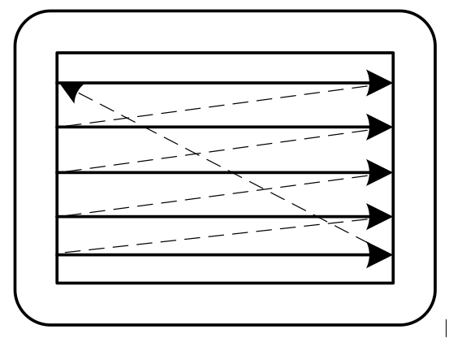
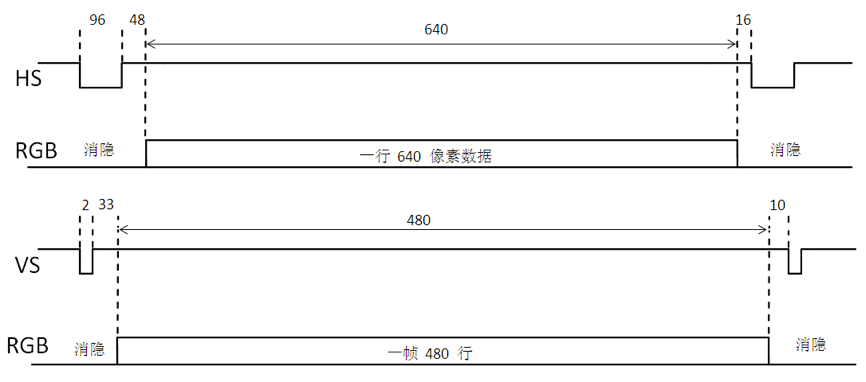

# VGA control
大约二十瓶颜料在桌子上整整齐齐地排成一溜儿。修拉拿了一支温森特见过的最小号的画笔，把笔尖在其中的一瓶颜料里蘸了一下，就着手在画布上以数学上的那种精确点起色点来。他平静地、毫不动情地工作着，点着，点着，点着。他笔直地握着画笔，只在颜料瓶里蘸一下，就往画布上点啊点的，点上成百上千细小的色点。                  – *《渴望生活·梵高传》，欧文·斯通*

AXI调用控制的VGA外设，对外通过一个AXI-LITE slave端被主机控制。并有一个AXI的Master接口不断读取存储设备中的数据并显示出来(没管刷新率)。屏幕分辨率为640*480。

## 代码结构
```
.
├── emu                   # 测试代码
│   ├── include
│   │   ├── cmem.h
│   │   ├── util.h
│   │   └── vgatest.h
│   ├── main.cpp
│   └── src
│       ├── cmem.cpp
│       └── vgatest.cpp
├── Makefile
├── README.md
└── src
    ├── buffer.v
    └── vga.v             # VGA控制器
```

## VGA控制介绍
VGA 接口的接口信号主要有 5 个： R （ Red ）、 G （ Green ）、 B （ Blue ）
HS （ Horizontal Synchronization ）和 VS （ Vertical Synchronization ），即红、绿、蓝、水平同步和垂直同步（也称行同步和帧同步）。

图像的显示是以像素（点）为单位，显示器的分辨率是指屏幕每行有多少
个像素及每帧有多少行，标准的 VGA 分辨率是 640 × 480 ，也有更高的分辨率，如 1024 × 768 、 1280 × 1024 、 1920 × 1200 等。从人眼的视觉效果考虑，屏幕刷新的频率（每秒钟显示的帧数）应该大于 24 ，这样屏幕看起来才不会闪烁， VGA显示器一般的刷新频率是 60HZ 。每一帧图像的显示都是从屏幕的左上角开始一行一行进行的，行同步信号是一个负脉冲，行同步信号有效后，由 RGB 端送出当前行显示的各像素点的RGB 电压值，当一帧显示结束后，由帧同步信号送出一个负脉冲，重新开始从屏幕的左上端开始显示下一帧图像，如[显示器扫描示意图]



RGB 端并不是所有时间都在传送像素信息，由于 CRT 的电子束从上一行的行尾到下一行的行头需要时间，从屏幕的右下角回到左上角开始下一帧也需要时间，这时 RGB 送的电压值为 0 （黑色），这些时间称为电子束的行消隐时间和场消隐时间，行消隐时间以像素为单位，帧消隐时间以行为单位。 VGA 行扫描、场扫描时序示意图如图所示：



在标准的 640 × 480 的 VGA 上有效显示一帧图像需要 2+33+480+10=525 行时间，其中场同步负脉冲宽度为 2 个行显示时间，场消隐后沿需要 33 个行显示
时间，然后每场显示 480 行，场消隐前沿需要 10 个行显示时间，一帧显示时间为 525 行显示时间，一帧消隐时间为 45 行显示时间。因此，在 640 × 480 的 VGA 上的一幅图像需要 525 × 800 = 420k 个像素点的时间。而每秒扫描 60 帧共需要约 25M 个像素点的时间。

## 模块介绍
每个像素点需要12bit来存储，为了对其，我使用了16bit来描述一个像素点。

所以需要的内存大小为640\*480\*2bit，大约600KB，片上的BRAM大小不够，我们需要调用片上的DDR资源。

vga由一个AXI4-lite的slave受控，以及一个AXI4的master去读取ddr中的显存数据，而在vga_ctrl中有两个buffer作为pingpong，俩个buffer轮流存放一行的数据，在屏幕输出这行的时候去读取下一行的数据。其中每个buffer中存放640个16位数据（320个32位），需要AXI进行俩次burst传输。

在CPU端需要设置vga的base_addr，然后再将启动位设置为1，VGA控制器就会不断地去读取DDR显存中的输出显存数据，需要改变屏幕的时候我们只需要从CPU端向DDR的对应的地址中写入数据。

| 说明                              | address    |
| --------------------------------- | ---------- |
| vga_ctrl启动位 (4byte)            | 0x80000000 |
| vga_ctrl的base_addr寄存器 (4byte) | 0x80000004 |
|                                   |            |

## test
运行```make run-emu```后运行```make show```查看波形图。